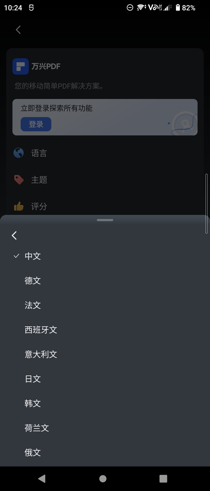

## App国际化（多语言）
### 背景
App需要支持不同国家语言，支持切换语言。

values：默认英语（English）
values-tl：菲律宾语
values-si：僧伽罗语（Sinhala）
values-fi：芬兰语（Finnish）
values-af：南非荷兰语（Afrikaans）
[国家语言码](https://www.jianshu.com/p/3e9bab5b0c98)
### 实现思路

### 方案
#### 方案一
通过上下文修改resources配置，调用ActivityCompat.recreate(activity)重建。注意需要通知所有Activity重建。
https://blog.csdn.net/StjunF/article/details/129203642
#### 方案二
修改语言后，finish掉所有页面 然后重启应用，应用重启后在ActivityLifecycle中监听onCrecated修改resources配置。
https://juejin.cn/post/6844904137226878984
#### 方案三
https://blog.csdn.net/qq_36874755/article/details/122882070
https://juejin.cn/post/7100956182697181197